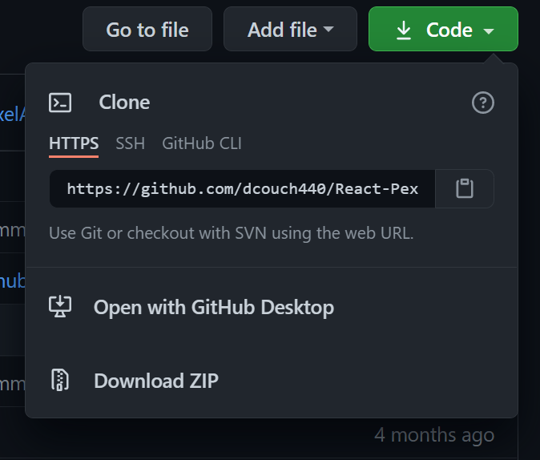
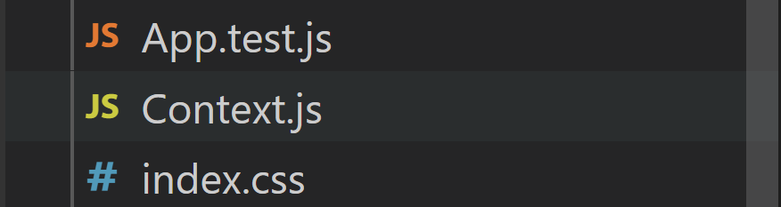

# React Pexal Api App Using Css Flex Box

#### Author: David Couch

## Description
***
#### This app is an example of using Pexal Api to display images that are loaded from pexals Free `limited` Api.

### `Technology Used:`
- HTML
- CSS
- JAVASCRIPT
- REACT
- STYLED COMPONENTS
- REACT ROUTER

###### This Software uses npm pexal api software. After the data is received it is sorted in an an object with functions made to emulate the efficacy of redux dispatch methods. After the data is sorted images are rendered on the page and an intersection observer is used to check if more data is needed. More request will be made to suite the need of the page. This project displays the use of useRef, useEffect, useReducer, useCallback, useRef, useContext, extensive looping and working with renders as object data changes.
***

### Note: This application requires an api key to access the content 
##### `Get your pexal Api Key At https://www.pexels.com/api/`
___

## Installation :
* Go to ( https://github.com/dcouch440/React-Pexal-Api.git ).

*  Navigate to the code button on the Github website.\


* Click on the code button to open the menu.\


- Copy the HTTPS code by clicking the clipboard next to the link.

- Within your Bash terminal navigate to your desired location by using cd fallowed by your desired directory.

```bash
 cd Desktop
``` 

- Once you have chosen your desired directory use the command.
```bash 
git clone https://github.com/dcouch440/React-Pexal-Api.git
```

<div 
  style="
    background-color: #d1ecf1; 
    color: grey; padding: 6px; 
    font-size: 9px; 
    border-radius: 5px; 
    border: 1px solid #d4ecf1; 
    margin-bottom: 12px"
> 
  <span 
    style="
      font-size: 12px; 
      font-weight: 600; 
      color: #0c5460;"
  >
    ⓘ
  </span>
  <span 
    style="
      font-size: 12px; 
      font-weight: 900; 
      color: #0c5460;
      margin-bottom: 24px"
  >
    Note : 
  </span> 
  If you have any problems make sure your HTTPS code is correct! The example above might not be the most recent HTTPS code!
</div>

* Then after the process is completed use the command.

``` bash
code .
```

* This will open the directory in your default code editor.

* After you have the file open in your project editor navigate to the file Context.js in the /src directory\
\

* After finding the API_KEY variable (shown below) replace the code with your own between quotes


* Your variable should look like this when your done but with your own key!

```javascript
// EXAMPLE KEY ONLY
const API_KEY = '3636922d5426672001gfismv64b3cb8d74154c398f838d1df9540346'
```

* Now run the fallowing code in the terminal you started with or feel free to use the terminal of the code editor you are using. Just make sure you are within the project directory! 

```bash
npm install
```
* Then run

```bash
npm start
```

* congratulations you are ready to go!

***

***

***

***

### `npm start`

Runs the app in the development mode.\
Open [http://localhost:3000](http://localhost:3000) to view it in the browser.

The page will reload if you make edits.\
You will also see any lint errors in the console.

### `npm test`

Launches the test runner in the interactive watch mode.\
See the section about [running tests](https://facebook.github.io/create-react-app/docs/running-tests) for more information.

### `npm run build`

Builds the app for production to the `build` folder.\
It correctly bundles React in production mode and optimizes the build for the best performance.

The build is minified and the filenames include the hashes.\
Your app is ready to be deployed!

See the section about [deployment](https://facebook.github.io/create-react-app/docs/deployment) for more information.

### `npm run eject`

**Note: this is a one-way operation. Once you `eject`, you can’t go back!**

If you aren’t satisfied with the build tool and configuration choices, you can `eject` at any time. This command will remove the single build dependency from your project.

Instead, it will copy all the configuration files and the transitive dependencies (webpack, Babel, ESLint, etc) right into your project so you have full control over them. All of the commands except `eject` will still work, but they will point to the copied scripts so you can tweak them. At this point you’re on your own.

You don’t have to ever use `eject`. The curated feature set is suitable for small and middle deployments, and you shouldn’t feel obligated to use this feature. However we understand that this tool wouldn’t be useful if you couldn’t customize it when you are ready for it.

The MIT License (MIT)

Copyright (c) 2021 David Couch

Permission is hereby granted, free of charge, to any person obtaining a copy of
this software and associated documentation files (the "Software"), to deal in
the Software without restriction, including without limitation the rights to
use, copy, modify, merge, publish, distribute, sublicense, and/or sell copies of
the Software, and to permit persons to whom the Software is furnished to do so,
subject to the following conditions:

The above copyright notice and this permission notice shall be included in all
copies or substantial portions of the Software.

THE SOFTWARE IS PROVIDED "AS IS", WITHOUT WARRANTY OF ANY KIND, EXPRESS OR
IMPLIED, INCLUDING BUT NOT LIMITED TO THE WARRANTIES OF MERCHANTABILITY, FITNESS
FOR A PARTICULAR PURPOSE AND NONINFRINGEMENT. IN NO EVENT SHALL THE AUTHORS OR
COPYRIGHT HOLDERS BE LIABLE FOR ANY CLAIM, DAMAGES OR OTHER LIABILITY, WHETHER
IN AN ACTION OF CONTRACT, TORT OR OTHERWISE, ARISING FROM, OUT OF OR IN
CONNECTION WITH THE SOFTWARE OR THE USE OR OTHER DEALINGS IN THE SOFTWARE.


